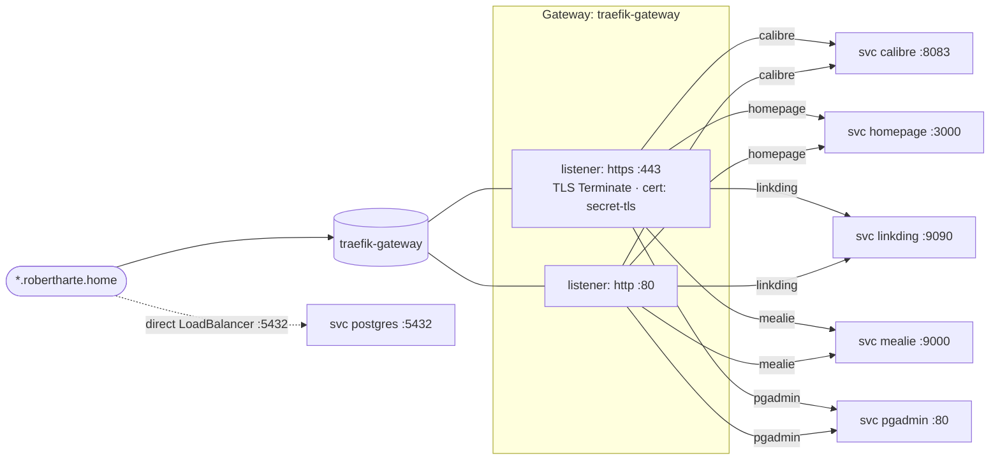

# HTTPRoutes

Gateway API routing topology for the cluster. All routes share a single Traefik-backed
Gateway. (Classic `Ingress` resources also exist for these apps but are intentionally
omitted here — see [[Home]].)

## HTTPRoutes

| HTTPRoute | Hostname | Listeners attached (`sectionName`) | Backend |
|-----------|----------|------------------------------------|---------|
| calibre   | calibre.robertharte.home  | http, https | calibre:8083 |
| homepage  | homepage.robertharte.home | http, https | homepage:3000 |
| linkding  | linkding.robertharte.home | http, https | linkding:9090 |
| mealie    | mealie.robertharte.home   | http, https | mealie:9000 |
| pgadmin   | pgadmin.robertharte.home  | http, https | pgadmin:80 |

All routes share the single `traefik-gateway` Gateway
(GatewayClass `traefik`, controller `traefik.io/gateway-controller`).

## Notes

- All five HTTPRoutes attach to both the `http` (:80) and `https` (:443) listeners.
- **PostgreSQL is intentionally not routed through the Gateway.** Its HTTPRoute (and
  Ingress) were removed — Postgres is a raw TCP service and is exposed directly via its
  own `LoadBalancer` Service on `:5432`, with TLS handled by Postgres (`sslmode`).
