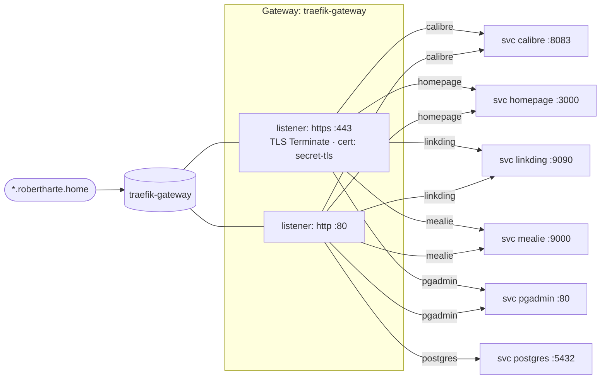

# HTTPRoutes

Gateway API routing topology for the cluster. All routes share a single Traefik-backed
Gateway. (Classic `Ingress` resources also exist for these apps but are intentionally
omitted here — see [[Home]].)

## HTTPRoutes

| HTTPRoute | Hostname | Listeners attached (`sectionName`) | Backend |
|-----------|----------|------------------------------------|---------|
| calibre   | calibre.robertharte.home  | http, https | calibre:8083 |
| homepage  | homepage.robertharte.home | http, https | homepage:3000 |
| linkding  | linkding.robertharte.home | http, https | linkding:9090 |
| mealie    | mealie.robertharte.home   | http, https | mealie:9000 |
| pgadmin   | pgadmin.robertharte.home  | http, https | pgadmin:80 |
| postgres  | postgres.robertharte.home | **http only** | postgres:5432 |

All routes share the single `traefik-gateway` Gateway
(GatewayClass `traefik`, controller `traefik.io/gateway-controller`).

## Notes

- **`postgres` attaches to the `http` listener only** — the other five attach to both
  `http` and `https`, so `https://postgres.robertharte.home` will not route.
- Postgres is a raw TCP service on `:5432`; routing it through an HTTP-layer Gateway is
  questionable. A Gateway API `TCPRoute` or a Traefik `IngressRouteTCP` is a better fit.
